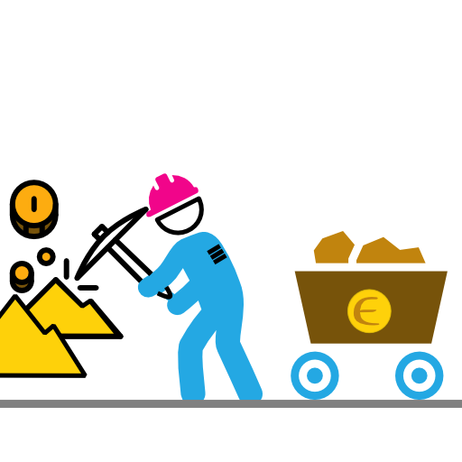

# Proof Of Uptime Skill

Earn EVER using your avatar!



One of the key ingredients of a robust network is the uptime of nodes in
the Network. This increases the number of Active Avatars on the network
and the capacity of the Network to take on jobs.

What the `proof-of-uptime` skill does is incentivises avatars for
connecting and supporting the network. Every day a Proof Of Uptime job
task is assigned to each Avatar which they need to perform the same day.

## Payout

Payout amount and the difficulty level is variable and depends on the
EVER balance of the Avatar.

```
<1000 EVER - 0.1 EVER
1000 - 10000 EVER - 0.5 EVER
>10000 - 50000 EVER -  2 EVER
> 50000 EVER - 5 EVER
```

### Required Qualification
Proof Of Uptime Skill Installation on Avatar Node

### Job Description
Your Avatar will be assigned a Proof Of Uptime Task every day, which
needs to be performed the same day. Each day a 2 digit letter
combination will be assigned to Avatars, they have to use the Proof Of
Uptime Skill to generate a valid Stellar Address that ends with this 2
letter suffix and submitted to the Job Mgr service run by EverLife. The
Job Mgr service would validate this and then pay each Avatar as per the
Payout plan.

## How-to Steps

1. Add Proof of Uptime Skill: Type `/install proof-of-uptime` to your Avatar
2. Enroll for Job: Type `/enroll 100100`

So go ahead, put your Avatar to work to strengthen the network and earn
EVER tokens for yourself and your loved ones!!
